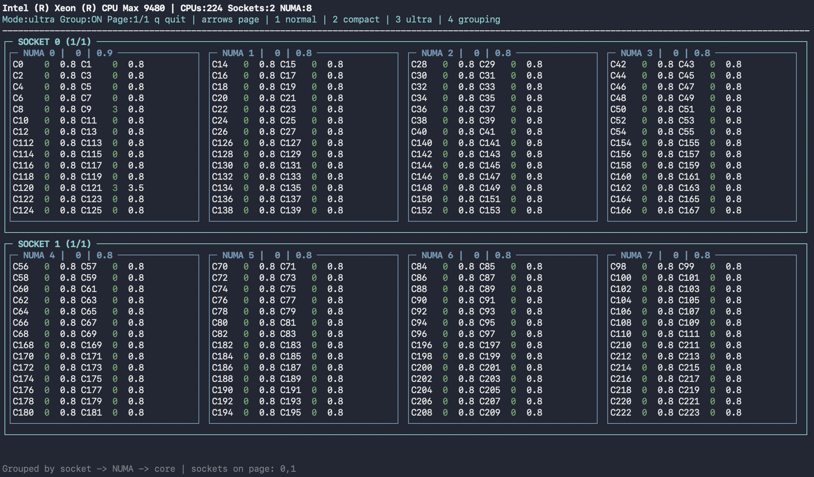

# CPU frequency display

Terminal CPU frequency and usage display for Linux systems, with layout support for large core-count and NUMA-heavy machines.

## Quick start

- via bash (fire-and-forget)

```bash
bash <(curl -fsSL https://raw.githubusercontent.com/HalfVulpes/cpufrequencydisplay/master/install.sh)
```

- via `curl` to download then run

```bash
curl -fsSLO https://raw.githubusercontent.com/HalfVulpes/cpufrequencydisplay/master/install.sh
chmod +x install.sh
./install.sh
```

- via `wget` to download then run

```bash
wget -q https://raw.githubusercontent.com/HalfVulpes/cpufrequencydisplay/master/install.sh
chmod +x install.sh
./install.sh
```

The installer defaults to:

- script install folder: `~/.local/share/freqdisp`
- launcher: `~/.local/bin/freqdisp`
- config file: `~/.local/share/freqdisp/.freqdisp.json`

The app saves your current `mode` and `grouping` choice whenever you press `1`, `2`, `3`, or `4`, then restores those settings on the next launch.

## Versioning

- `freqdisp --version` prints the installed version
- local git checkouts use `git describe --tags --always --dirty`
- installer-based installs write the selected ref into `VERSION`

By default, `install.sh` installs the latest git tag when one exists. You can override that with:

```bash
FREQDISP_REF=master bash <(curl -fsSL https://raw.githubusercontent.com/HalfVulpes/cpufrequencydisplay/master/install.sh)
```

## Manual run

If you want to keep a standalone copy instead of using the installer:

```bash
chmod +x ./freqdisp
./freqdisp
```

When run this way, the config is still saved beside the script in the current installation folder.

## Example


