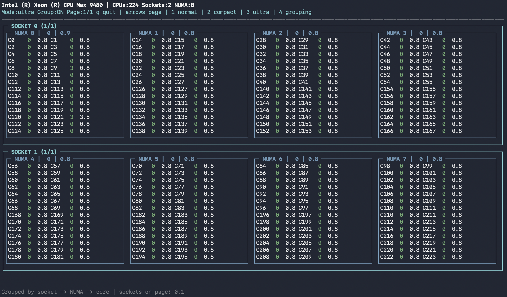

# CPU frequency display

Terminal CPU frequency and usage display for Debian, Proxmox VE, Fedora, macOS, and FreeBSD systems, with layout support for large core-count and NUMA-heavy Linux machines.

## Supported platforms

- Debian, Proxmox VE, Fedora, and other Linux systems: CPU usage comes from `/proc/stat`; frequency comes from cpufreq sysfs with `/proc/cpuinfo` fallback for virtualized hosts such as PVE.
- macOS: CPU count/model/frequency comes from `sysctl`, and usage comes from Mach CPU counters. Some Apple Silicon systems do not expose live CPU frequency, so frequency may display as unknown while usage still works.
- FreeBSD: CPU count, frequency, and usage come from `sysctl`. FreeBSD topology is shown as one socket/NUMA group unless richer topology data is added later.

## Quick start

- via `curl`

```bash
curl -fsSL https://raw.githubusercontent.com/HalfVulpes/cpufrequencydisplay/master/install.sh | sh
```

- via `wget`

```bash
wget -qO- https://raw.githubusercontent.com/HalfVulpes/cpufrequencydisplay/master/install.sh | sh
```

- via FreeBSD `fetch`

```sh
fetch -q -o - https://raw.githubusercontent.com/HalfVulpes/cpufrequencydisplay/master/install.sh | sh
```

- via `curl` to download then run

```bash
curl -fsSLO https://raw.githubusercontent.com/HalfVulpes/cpufrequencydisplay/master/install.sh
chmod +x install.sh
./install.sh
```

- via `wget` to download then run

```bash
wget -q https://raw.githubusercontent.com/HalfVulpes/cpufrequencydisplay/master/install.sh
chmod +x install.sh
./install.sh
```

The installer defaults to:

- script install folder: `~/.local/share/freqdisp`
- launcher: `~/.local/bin/freqdisp`
- config file: `~/.local/share/freqdisp/.freqdisp.json`

It also adds `~/.local/bin` to your shell PATH automatically. For Bash it updates
`~/.bashrc` and `~/.profile`; for Zsh it updates `~/.zshrc` and `~/.zprofile`;
for Csh/Tcsh it updates `~/.cshrc`; other POSIX shells use `~/.profile`. New
terminals pick up the change automatically.

The app saves your current `mode` and `grouping` choice whenever you press `1`, `2`, `3`, or `4`, then restores those settings on the next launch.

## Versioning

- `freqdisp --version` prints the installed version
- local git checkouts use `git describe --tags --always --dirty`
- installer-based installs write the selected ref into `VERSION`

By default, `install.sh` installs the latest git tag when one exists. You can override that with:

```bash
curl -fsSL https://raw.githubusercontent.com/HalfVulpes/cpufrequencydisplay/master/install.sh | FREQDISP_REF=master sh
```

## Manual run

If you want to keep a standalone copy instead of using the installer:

```bash
chmod +x ./freqdisp
./freqdisp
```

When run this way, the config is still saved beside the script in the current installation folder.

## Example


